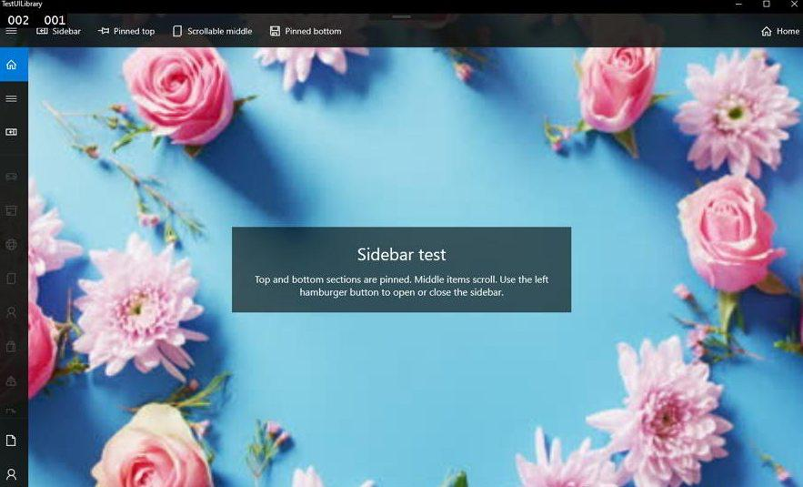
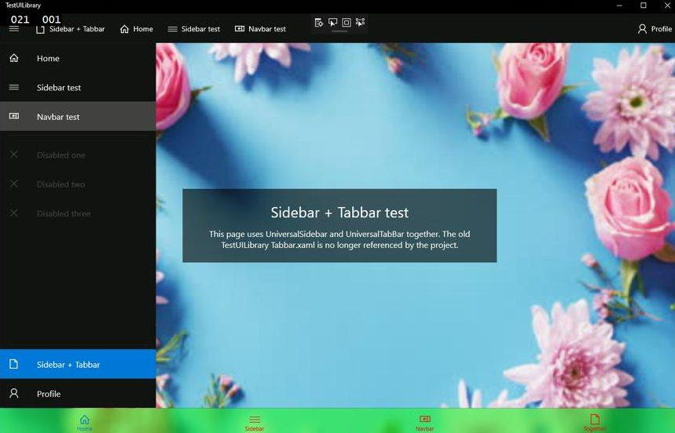
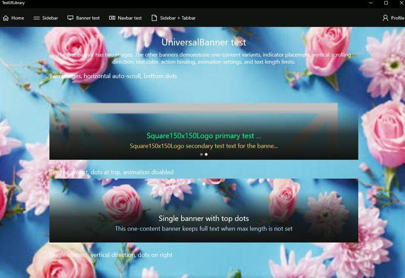

# LegacyProjects UI UWP Library

# EN:
## What is it? This is a library that is being added next to the main UWP Visual Studio 2015/2017 (maybe even 2019) project, it adds new elements to the xaml editor that are easily editable and have many fine adjustments.

## Currently implemented:
- tabbar
- sidebar
- navbar
- banner

### Information about setting up each of the above listed elements is <a href="https://github.com/zemonkamin/LegacyProjects.UI.UniversalWindowsPlatform/tree/main/Docs/English">here</a>

 

 

# RU:
## Что это? Это библиотека, которая добавляется рядом с основным проектом UWP Visual Studio 2015/2017 (возможно даже 2019), она добавляет в xaml редактор новые элементы, которые удобно редактируются и имеют много тонких настроек.

## В данный момент реализовано:
- таббар
- сайдбар
- навбар
- баннер

### Информация о настройке каждого из выше перечисленных элементов находится <a href="https://github.com/zemonkamin/LegacyProjects.UI.UniversalWindowsPlatform/tree/main/Docs/Russian">здесь</a>

# Screenshots:

# Developers:
<table style="border-collapse: separate; border-spacing: 0 10px;">
<tr>
    <td style="vertical-align: middle;">
      
    </td>
    <td style="vertical-align: middle; padding-left: 12px; font-size: 16px;">
      zemonkamin
    </td>
</tr>
</table>
